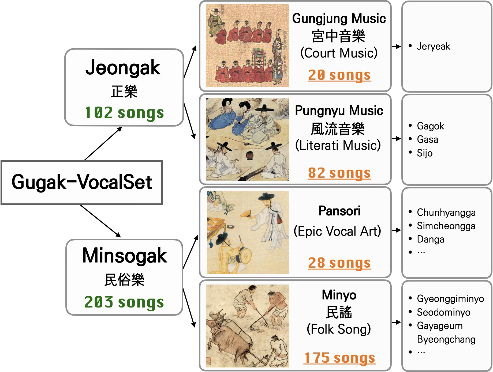
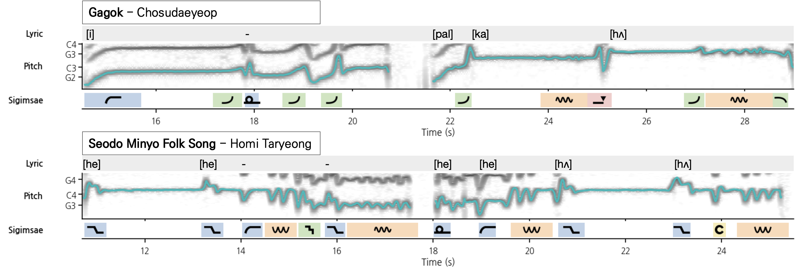
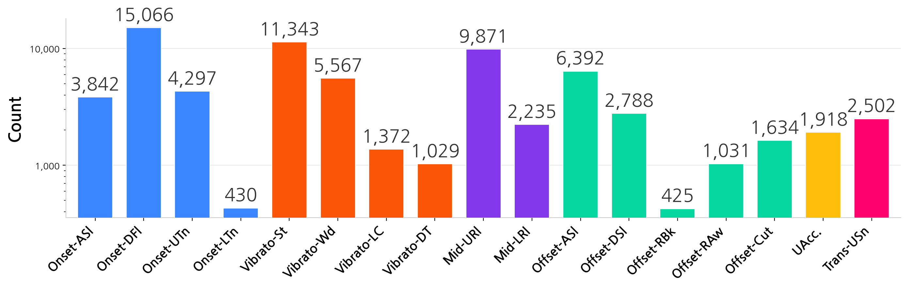
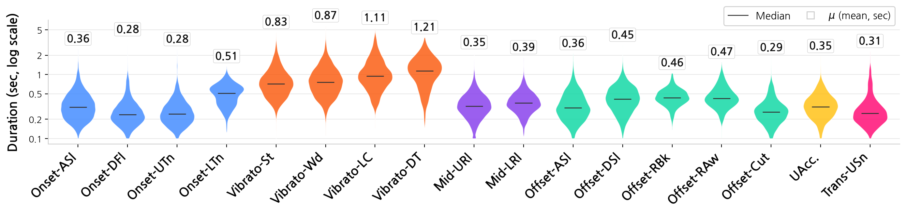

# Gugak-VocalSet

**A High-quality Korean Traditional Singing Dataset with Sigimsae Annotations**

> This repository accompanies our ISMIR 2026 submission.
> **Anonymous release for double-blind review.** Author names, affiliations, and any identifying metadata have been removed from the code, documentation, and dataset packaging.

---

## Overview

Gugak-VocalSet is the first publicly available audio dataset for Korean traditional singing, with dense annotations of *sigimsae* — the continuous pitch-level vocal expression that constitutes the melodic identity of Korean traditional vocal music.

- **24.5 hours** of unaccompanied solo vocal recordings
- **300 pieces / 305 tracks** of representative repertoire curated by the National Gugak Center
- **20 professional singers**, recorded in a controlled studio environment with fixed key and tempo
- **~69,000 audio-grounded sigimsae annotations** following a unified **17-type ontology** organized by functional position (onset / mid-note / offset / transition / accent / vibrato)
- Rich metadata: genre hierarchy, lyrics–audio alignment, Western key, jangdan, tempo, bilingual captions, expert mood & timbre tags

<p align="center">
  
</p>

*Gugak-VocalSet covers two top-level genres (Jeongak / Minsogak), four mid-level categories by musical function, and a range of sub-genres. Track counts shown at each level.*

---

## Sigimsae Ontology

The 17 sigimsae types are organized by **functional position within the melodic line**:

| Group | Types (Korean label → English) |
|---|---|
| **Onset** *(앞시김새)* | 밀어내기 → onset asc. slide · 꺾어내기 → onset desc. flick · 감아내기(위) → onset upper turn · 감아내기(아래) → onset lower turn |
| **Vibrato** *(요성)* | 보통 요성 → standard vibrato · 격한 요성 → wide vibrato · 아래로 향하는 요성 → lower-centered vibrato · 흘러내리는 요성 → desc.-tail vibrato |
| **Mid-note** *(중간 시김새)* | 굴려내기(위) → mid-note upper roll · 굴려내기(아래) → mid-note lower roll |
| **Offset** *(뒷시김새)* | 추성 *(chuseong)* → offset asc. slide · 퇴성 *(toeseong)* → offset desc. slide · 끝굴려내기(위) → offset roll-back · 끝굴려내기(아래) → offset lower roll-away · 끊어내기 → offset sharp cut |
| **Accent** *(강조 시김새)* | 전성 *(jeonseong)* → upward-accented vibrato |
| **Transition** *(경과 시김새)* | 채올리기 → transition upward snap |

See the paper for notation symbols, contour illustrations, and examples.

---

## Dataset Files

Each track has a stable ID of the form

```
KC_TM_{JC|MF}_{GJ|PR|MY|PS}_P{######}
```

| Segment | Meaning |
|---|---|
| `KC_TM` | fixed dataset prefix |
| `JC` / `MF` | top-level genre — **정악 (Jeongak)** / **민속악 (Minsogak)** |
| `GJ` / `PR` / `MY` / `PS` | mid-level genre — **궁중음악 (GJ)** / **풍류음악 (PR)** / **민요 (MY)** / **판소리 (PS)** |
| `P######` | 6-digit zero-padded track index |

For each track we release (i) one row in a track-level metadata CSV and (ii) one JSON file holding the time-aligned annotations.

---

## Track-level Metadata (`metadata.csv`)

Each row describes one track; the track ID column keys into the annotation JSON filename.

| Column | Type | Description |
|---|---|---|
| `정제데이터 파일명` *(track ID)* | string | Stable track identifier, e.g. `KC_TM_JC_PR_S000001`. Matches the annotation JSON filename (with `S` → `P`). |
| `분류_업데이트` *(category)* | categorical | Fine-grained style category: 정가, 궁중악, 풍류악, 판소리, 민요. |
| `장르` *(top-level genre)* | categorical | **정악** or **민속악**. |
| `하위장르` *(mid-level genre)* | categorical | 궁중음악 · 풍류음악 · 판소리 · 민요. |
| `세부장르(optional)` *(sub-genre)* | categorical | Genre-specific sub-label (23 values). For pansori: the narrative (e.g. 심청가, 춘향가). For folk songs: representative regional origin (남도, 경기, 서도, 병창). |
| `곡명` *(title)* | string | Piece title. |
| `가창자` *(singer)* | string | Performer name (20 singers). |
| `가창자 성별` *(gender)* | categorical | **남창** / **여창**. |
| `최종 서양조성` *(Western key)* | string | Western-music key tag (e.g. `Ab / Fm`), assigned by Western-music-trained annotators for general-purpose use. |
| `장단` *(jangdan)* | string | Rhythmic cycle (17 distinct values across the corpus). |
| `최종 박자` *(time signature)* | string | e.g. `48/8`, `12/8`. |
| `최종 템포` *(tempo)* | float | BPM. |
| `moods_all` | string | Expert mood tags with vote counts, comma-separated (80-tag vocabulary). Example: `기품 있는(2), 잔잔한(2), ...`. |
| `timbres_all` | string | Expert timbre tags with vote counts, comma-separated (38-tag vocabulary). |
| `캡션(한국어)` *(caption, KR)* | string | Korean prose caption describing the piece. Duplicated in the JSON as `caption_ko`. |
| `캡션(영어)` *(caption, EN)* | string | English prose caption. Duplicated in the JSON as `caption_en`. |
| `가사` *(lyrics, full text)* | string | Full transcribed lyrics of the piece, line-separated. |
| `JSON_가사_모음` *(lyrics segments)* | string | Lyrics split into phrase-level segments (`/`-separated). Aligned 1-to-1 with `lyrics_regions` in the JSON. |
| `가사세그먼트` *(n-segments)* | int | Number of phrase segments. |
| `오디오_길이(초)` *(duration)* | float | Audio duration in seconds. Mean 286.7 s, median 260.1 s. |

> **Not released.** Internal fields (`Old ID`, `예상금액`, `길이수정됨`, `배정_라벨러`, `라벨러이름`) are stripped before distribution.

---

## Per-track Annotation JSON

Each track has a JSON file named after its track ID, e.g. `KC_TM_JC_GJ_P000074.json`, containing the time-aligned lyrics and sigimsae annotations plus bilingual captions:

```jsonc
{
  "info": {
    "identifier": "KC_TM_JC_GJ_P000074",   // matches the filename (sans .json)
    "source_id":  "KC_TM_JC_GJ_M000074"    // original studio master ID (same index, M prefix)
  },
  "annotation": {
    "lyrics_regions": [
      {
        "lyrics_id":  "L001",              // L###, unique within the track
        "start_sec":  1.693031553127439,   // phrase start (seconds)
        "end_sec":   15.494926962443781,   // phrase end   (seconds)
        "lyrics":    "황의상제 구민지막"   // text as actually sung
      }
      // ... 7–20 s phrases, delimited by jangdan structure
    ],
    "sigimsage_regions": [
      {
        "sigimsage_id":    "S001",              // S###, unique within the track
        "start_sec":       3.6434831084847805,
        "end_sec":         3.8613000334485466,
        "sigimsage_types": ["추성"]             // one or more labels (see ontology above)
      }
      // ... typically 150–400 events per track
    ],
    "caption_ko": "귀인은 종묘제례악 중 하나로, …",
    "caption_en": "Gwi-in is one of the movements in Jerye Ritual Music, …"
  }
}
```

### Field reference

**`info`**

| Key | Type | Description |
|---|---|---|
| `identifier` | string | Track ID; matches the filename. |
| `source_id`  | string | Master recording ID; identical numeric part with an `M` prefix. |

**`annotation.lyrics_regions[]`** — phrase-level lyrics–audio alignment (7–20 s per region, delimited by jangdan). The regions are in 1-to-1 correspondence with the `JSON_가사_모음` column in `metadata.csv`.

| Key | Type | Description |
|---|---|---|
| `lyrics_id` | string | Per-track unique, zero-padded (`L001`, `L002`, …). |
| `start_sec` / `end_sec` | float | Region bounds in seconds from the start of the audio. |
| `lyrics` | string | Transcribed text exactly as sung by the performer. |

**`annotation.sigimsage_regions[]`** — event-level sigimsae annotations.
*(The key is spelled `sigimsage_*` in the JSON; the label vocabulary and paper text use the romanization **sigimsae**.)*

| Key | Type | Description |
|---|---|---|
| `sigimsage_id` | string | Per-track unique, zero-padded (`S001`, `S002`, …). |
| `start_sec` / `end_sec` | float | Event bounds in seconds (mean duration ≈ 0.47 s). |
| `sigimsage_types` | list[string] | One or more Korean labels drawn from the 17-type ontology above. ~4.9 % of regions carry **two or more labels** (multi-label). |

**`annotation.caption_ko` / `caption_en`** — free-text bilingual captions, mirroring the corresponding columns in `metadata.csv`.

### Annotation example

<p align="center">
  
</p>

Each panel shows the three layers of time-aligned annotation for one excerpt: **phrase-level lyrics** (top), **F0 contour** overlaid on the spectrogram (middle), and **sigimsae regions** color-coded by functional group — onset (blue), mid-note (purple), vibrato (orange), offset (green), accent (yellow), transition (pink). Top: Jeongak (*Gagok — Chosudaeyeop*). Bottom: Minsogak (*Seodo Minyo — Homi Taryeong*).

### Label statistics

Across 305 tracks / ~69k regions (multi-label regions: ~4.9%):

<p align="center">
  
</p>

*Instance count per type (log scale), grouped by functional position. Onset-DFl (꺾어내기) and Vibrato-St (보통 요성) dominate; Onset-LTn (감아내기 아래) and Offset-RBk (끝굴려내기 위) are the rarest.*

<p align="center">
  
</p>

*Duration distribution per type (violin plot, log scale; numbers above show mean in seconds). Vibrato types exhibit notably longer durations (mean ~0.8–1.2 s) than non-vibrato ornaments (~0.3–0.5 s), reflecting the sustained oscillatory nature of vibrato.*

---

## Sample Release

For double-blind review, this repository ships a **5-track audio + annotation sample** (one per major genre/style group) so reviewers can directly inspect the raw recordings alongside the JSON annotations. The **complete track-level metadata for all 305 tracks is already included** in `metadata.csv`; the remaining 300 audio recordings and annotation JSONs will be released upon publication.

| Track ID | Genre | Sub-genre | Title | Singer | Gender | Duration |
|---|---|---|---|---|---|---|
| `KC_TM_JC_GJ_P000074` | Jeongak / Gungjung | 제례악 (ritual) | 종묘제례악 중 귀인 (*Gwi-in*, from Jongmyo Jerye-ak) | 이동영 | 남창 | 4:26 |
| `KC_TM_JC_PR_P000001` | Jeongak / Pungnyu | 가곡 (Gagok) | 남창가곡 반우반계 반엽 | 홍창남 | 남창 | 7:03 |
| `KC_TM_MF_PS_P000285` | Minsogak / Pansori | 춘향가 (Chunhyangga) | 진양 사랑가 1 | 전소이 | 여창 | 4:19 |
| `KC_TM_MF_MY_P000174` | Minsogak / Minyo | 남도민요 (Namdo) | 물레타령 1 | 이주은 | 여창 | 3:37 |
| `KC_TM_MF_MY_P000103` | Minsogak / Minyo | 경기민요 (Gyeonggi) | 매화타령 | 채수현 | 여창 | 5:00 |

Repository layout for these samples:

```
sample/
├── audio/                                  # 5 mp3 files (~58 MB total)
│   ├── KC_TM_JC_GJ_P000074.mp3
│   ├── KC_TM_JC_PR_P000001.mp3
│   ├── KC_TM_MF_PS_P000285.mp3
│   ├── KC_TM_MF_MY_P000174.mp3
│   └── KC_TM_MF_MY_P000103.mp3
└── annotation/                             # 5 JSON files (schema as above)
    ├── KC_TM_JC_GJ_P000074.json
    ├── KC_TM_JC_PR_P000001.json
    ├── KC_TM_MF_PS_P000285.json
    ├── KC_TM_MF_MY_P000174.json
    └── KC_TM_MF_MY_P000103.json
```

The `mp3` and `json` files share the track ID, and both correspond 1-to-1 with the row in `metadata.csv` whose `정제데이터 파일명` equals the same ID with `S` ↔ `P` (e.g. `KC_TM_JC_GJ_S000074` ↔ `KC_TM_JC_GJ_P000074`).

---

## Dataset Release

This repository serves as the anonymous companion site during review. It currently ships the **complete track-level metadata** (`metadata.csv`, 305 rows) and the **5-track sample** described above (`sample/`). The remaining 300 audio recordings and annotation JSONs will be released upon publication.

---

## Experiment Code

The `src/` and `configs/` directories ship the experiment code that produced the results in the paper. **The code is provided for reviewer inspection** — it documents the training procedure, model architectures, dataset construction, and evaluation metrics. Some imports reference modules from the original development repository (e.g. `prepare_f0_dataset.py`, `train.py`, `train_event.py`) that are not included in this anonymous release; the canonical 5-fold CV scripts in `src/` are self-explanatory for review purposes.

### Layout

```
src/
├── classification/                      # Tables 2 & 3
│   ├── train_kfold.py                   # 5-fold CV training; also drives cross-genre runs
│   ├── models.py                        # F0CNN (SigimsaeCNN), MelCNN, MERTEmbeddingClassifier
│   └── dataset.py                       # F0 / mel / embedding dataset classes
└── event/                               # Table 4
    ├── train_event_kfold.py             # 5-fold CV event-detection training
    ├── models_event.py                  # EDTCN, MERTHead (BiGRU probe over MERT hidden states)
    ├── event_dataset.py                 # Frame-level dataset (10 ms hop, don't-care boundaries)
    └── metrics_event.py                 # Frame F1, onset F1, event F1, IoU F1

configs/                                 # Classification YAML configs (see base.yaml for shared defaults)
├── base.yaml
├── b2_f0cnn.yaml                        # F0 CNN
├── b3_melcnn.yaml                       # Mel CNN
├── b5_mert95M_17cat.yaml                # MERT-v1-95M MARBLE probing
├── b5_mert_emb_330M.yaml                # MERT-v1-330M MARBLE probing
└── b5_culturemert95M_17cat.yaml         # CultureMERT-95M MARBLE probing
```

### Mapping to paper tables

| Paper | Code |
|---|---|
| **Table 2** — 17-category sigimsae classification (F0CNN, MelCNN, MERT-v1-95M/330M, CultureMERT-95M) | `src/classification/train_kfold.py` + corresponding `configs/b{2,3,5_*}.yaml` |
| **Table 3** — Cross-genre transfer (Jeongak ↔ Minsogak) | `src/classification/train_kfold.py` with the cross-genre flags |
| **Table 4** — 17-category event detection (EDTCN with f0/mel inputs, MERT/CultureMERT probing with BiGRU) | `src/event/train_event_kfold.py` with `--model {EDTCN, MERTHead}` and `--feature-type {f0, mel, mert_hidden}` |

### Notes for reviewers

- Both training scripts use **per-song stratified 5-fold CV** with a fixed seed, so a single invocation reproduces all five folds reported in the paper.
- F0 features are extracted with **RMVPE at 10 ms hop**. The `delta_f0` channel is scaled (×10) and clipped inside the dataset class — without this normalization the channel has near-zero variance and is effectively ignored by the first conv layer.
- MERT / CultureMERT probing operates on **pre-extracted hidden states** rather than raw waveforms, following the MARBLE protocol. The extraction step is handled by external scripts not included in this release.
- The `src/` files are translated into English; only data values that match against the actual annotation files (e.g. genre identifiers `정악`/`민속악`, sigimsae class names) remain in Korean.

---

## License

- **Code:** released under the MIT License (see `LICENSE`).
- **Dataset:** distributed under CC BY-NC-SA 4.0. Recordings were made under agreements with the performers and the National Gugak Center.

---

## Citation

Citation information will be provided upon publication. During the review period, please refer to this repository only as the anonymous companion to the ISMIR 2026 submission titled *"Gugak-VocalSet: A High-quality Korean Traditional Singing Dataset with Sigimsae Annotations."*

---

## Anonymity Notice for Reviewers

Please do not attempt to de-anonymize this repository. We have scrubbed author names, affiliations, acknowledgements, and identifying commit metadata. Any remaining identifying artifacts are unintentional — we would be grateful if you could notify the program chairs so they can be removed.
